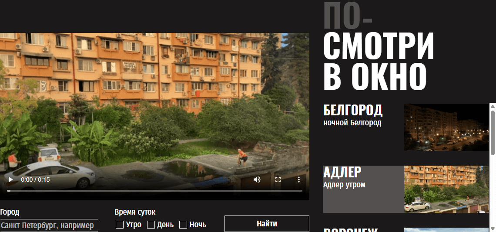
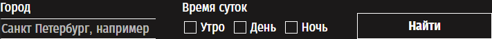
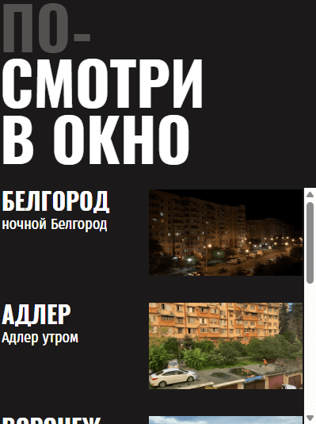

<h1 align="center">«Посмотри в окно»</h1>

  
*Интерактивное веб-приложение для просмотра видео с камер наблюдения по всему миру*

**«Посмотри в окно»** - это стильное и функциональное приложение, которое позволяет наблюдать за улицами разных городов в режиме реального времени (на основе демо-данных). Проект демонстрирует мои навыки вёрстки сложных интерфейсов по макету, работу с кастомными элементами форм, анимациями и адаптацию готового JavaScript-кода под дизайн.

[](https://github.com/cloudxvii/posmotri_v_okno/actions/workflows/tests.yml)

## 🚀 Демо

Приложение можно запустить локально, открыв файл `index.html` в браузере.  
*Деплой не предусмотрен, но вы можете склонировать репозиторий и попробовать всё самостоятельно.*

## 🛠 Технологии

<div align="center">
  
  
  
  
  
</div>

- **HTML5** - семантическая разметка, использование `<template>` для динамического контента.
- **CSS3** - Flexbox, Grid, кастомные чекбоксы, анимации (прелоадер), стилизация скроллбара.
- **JavaScript** - готовый скрипт для работы с API, подгрузки данных, пагинации и обработки ошибок (не мой код, но интегрирован с вёрсткой).
- **Шрифты** - Oswald, Fira Sans Condensed (подключены локально).
- **Работа с макетом** - точное соответствие дизайну из Figma.

## ✨ Функциональность

- 🎥 **Основной видеоплеер** - автоматически воспроизводит первое видео из списка.
- 🔍 **Поиск и фильтрация** - по названию города и времени суток (утро, день, ночь).
- 📋 **Список карточек** - превью видео с заголовком и описанием, возможность прокрутки.
- 🔄 **Пагинация** - кнопка «Показать ещё» подгружает следующие 5 видео.
- ⚡ **Прелоадеры** - анимированные индикаторы загрузки в блоке видео и списке карточек.
- ❌ **Обработка ошибок** - при отсутствии видео или проблемах с сетью показывается сообщение.
- 🎨 **Кастомные элементы** - стилизованные чекбоксы, кнопки, текстовое поле.
- 🖱️ **Интерактивные состояния** - `:hover`, `:active`, `:focus-visible`, `:checked` для всех элементов.
- 🎯 **Активная карточка** - выделение текущего видео фоном.

## 📸 Скриншоты

| Форма поиска и фильтры | Список карточек |
|------------------------|-----------------|
|  |  |

## 🔍 Особенности реализации

- **Точная вёрстка по макету** - все отступы, размеры, цвета и типографика соответствуют дизайну.
- **Кастомные чекбоксы** - скрыты нативные чекбоксы, вместо них отрисованы псевдоэлементы с состоянием `:checked`.
- **Адаптивность (фиксированная)** - сайт рассчитан на десктоп с шириной 1200px, но все блоки аккуратно выровнены.
- **Продвинутые CSS-селекторы** - использование `:has(:focus-visible)` для стилизации фокуса у родительского лейбла.
- **Прелоадер** - анимированные квадраты, реализованные на чистом CSS (keyframes).
- **Обработка переполнения текста** - для заголовков и описаний используются `text-overflow: ellipsis` и `line-clamp`.
- **Стилизация скроллбара** - сохранена из заготовки, соответствует макету.
- **Работа с готовым JavaScript** - вёрстка не ломает функциональность, все динамические элементы (темплейты) корректно стилизованы.

## 🧱 Структура проекта

```
посмотри-в-окно/
├── .github/               # GitHub Actions для тестов
├── fonts/                  # Шрифты Oswald и Fira Sans Condensed
├── images/                 # Скриншоты для README
├── scripts/
│   └── script.js           # Готовая логика приложения
├── styles/
│   ├── style.css           # Основные стили (моя работа)
│   ├── error.css           # Стили для блока ошибки
│   └── preloader.css       # Стили для прелоадера
├── index.html              # Главная страница с разметкой
└── README.md               # Этот файл
```

## 🚦 Запуск проекта локально

```bash
# Клонируйте репозиторий
git clone https://github.com/cloudxvii/posmotri_v_okno.git

# Перейдите в папку проекта
cd posmotri_v_okno

# Откройте index.html в любом современном браузере
# Можно также использовать Live Server в VS Code для автоматического обновления
```

## 🎯 Цель проекта

Проект был выполнен в рамках учебной программы для отработки навыков:

- вёрстки сложных интерфейсов по макету;
- создания кастомных элементов форм и их состояний;
- стилизации динамически подгружаемого контента (темплейты);
- работы с готовым JavaScript-кодом и сохранения его функциональности.

## 📝 Что сделано мной

- Полная стилизация всех элементов интерфейса в соответствии с макетом.
- Реализация кастомных чекбоксов и полей ввода.
- Адаптация прелоадеров и блоков ошибок.
- Настройка состояний наведения, фокуса и активности для всех интерактивных элементов.
- Обеспечение корректного отображения динамически добавляемых карточек и кнопки «Показать ещё».
- Выравнивание блоков с использованием Flexbox и Grid.